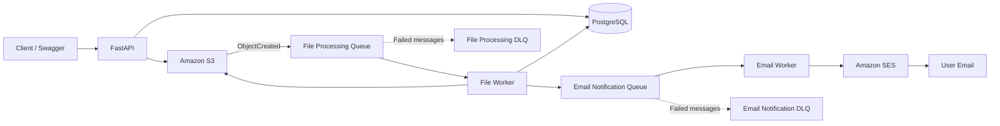
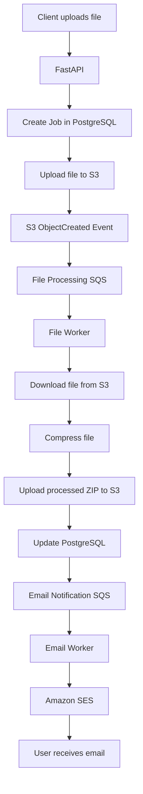
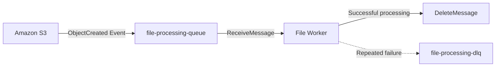
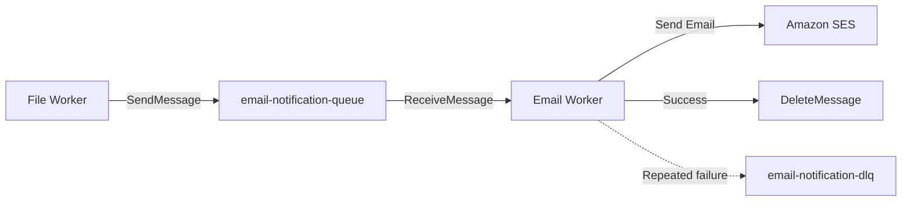
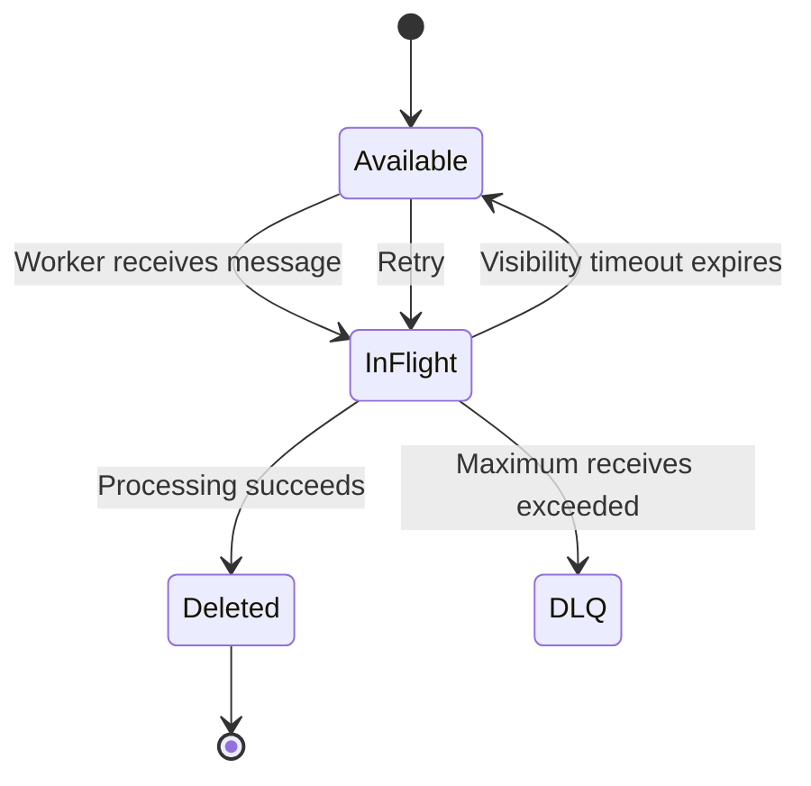
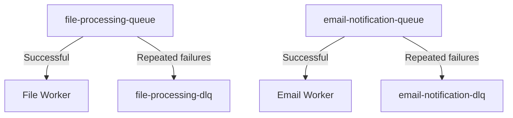
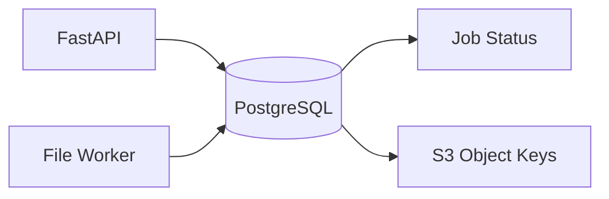

# Asynchronous File Processing System

A basic asynchronous file-processing backend built with **FastAPI, PostgreSQL, Amazon S3, Amazon SQS, and Amazon SES**.

The application accepts a file upload through FastAPI, stores the file in S3, processes it asynchronously using SQS and a background worker, stores the processed file back in S3, updates the job status in PostgreSQL, and sends an email notification through a separate SQS queue and SES.

---

## Architecture



---

## Basic Application Flow



---

## Project Structure

```text
file-processing-system/
│
├── alembic/
│   ├── versions/
│   ├── env.py
│   ├── README
│   └── script.py.mako
│
├── app/
│   ├── __init__.py
│   ├── main.py
│   │
│   ├── api/
│   │   ├── __init__.py
│   │   ├── dependencies.py
│   │   └── routes/
│   │       ├── __init__.py
│   │       └── files.py
│   │
│   ├── core/
│   │   ├── __init__.py
│   │   └── config.py
│   │
│   ├── db/
│   │   ├── __init__.py
│   │   └── database.py
│   │
│   ├── models/
│   │   ├── __init__.py
│   │   └── file.py
│   │
│   ├── schemas/
│   │   ├── __init__.py
│   │   └── file.py
│   │
│   ├── repositories/
│   │   ├── __init__.py
│   │   └── file_repository.py
│   │
│   ├── services/
│   │   ├── __init__.py
│   │   ├── file_service.py
│   │   ├── s3_service.py
│   │   ├── sqs_service.py
│   │   ├── compression_service.py
│   │   └── email_service.py
│   │
│   └── workers/
│       ├── __init__.py
│       ├── file_worker.py
│       └── email_worker.py
│
├── tests/
│   └── __init__.py
│
├── .env
├── .gitignore
├── requirements.txt
└── README.md
```

---

## Queue Architecture

The application uses **two SQS queues**.

### 1. File Processing Queue



**Purpose:**  
Receives an event whenever a new file is uploaded under the `uploads/` prefix in S3.

The File Worker then:

1. Receives the SQS message.
2. Extracts the S3 object information.
3. Finds the corresponding job in PostgreSQL.
4. Downloads the file.
5. Compresses the file.
6. Uploads the ZIP file to `processed/`.
7. Updates the database.
8. Sends an email notification message.
9. Deletes the SQS message after successful processing.

---

### 2. Email Notification Queue



**Purpose:**  
Separates email delivery from file processing.

The Email Worker:

1. Receives the notification message.
2. Reads the job status and recipient email.
3. Sends the email through SES.
4. Deletes the message only after successful email delivery.

---

## How SQS Messages Work

SQS does not immediately delete a message when a worker receives it.



Basic behavior:

```text
Message arrives
      ↓
Available in SQS
      ↓
Worker receives message
      ↓
Message becomes temporarily invisible
      ↓
Worker processes message
      ↓
Success → DeleteMessage
Failure → Message is not deleted
      ↓
Visibility timeout expires
      ↓
Message becomes available again
      ↓
Retry
      ↓
Repeated failure → DLQ
```

---

## Dead Letter Queues

Each main queue has its own DLQ.



Current design:

```text
file-processing-queue
        |
        | max receive count
        v
file-processing-dlq
```

and:

```text
email-notification-queue
        |
        | max receive count
        v
email-notification-dlq
```

The DLQ allows failed messages to be isolated instead of being retried indefinitely.

---

## S3 Structure

The S3 bucket is logically divided into two prefixes:

```text
file-processing-bucket-19/
│
├── uploads/
│   └── <job_id>/
│       └── filename.ext
│
└── processed/
    └── <job_id>/
        └── filename.ext.zip
```

Only the `uploads/` prefix triggers the S3 → SQS event.

This prevents processed files from triggering the file-processing queue again.

---

## Database Flow

PostgreSQL stores information about the job rather than the actual file.



Example status flow:

```text
UPLOADING
    ↓
UPLOADED
    ↓
PROCESSING
    ↓
COMPLETED
```

If something fails:

```text
UPLOADING / PROCESSING
        ↓
      FAILED
```

---

## Main Components

### FastAPI

Handles:

- File upload API
- Request validation
- Job creation
- Database interaction
- S3 upload
- Job status API

### PostgreSQL

Stores:

- Job ID
- Filename
- Email
- Original S3 key
- Processed S3 key
- Processing status
- Error message
- Timestamps

### Amazon S3

Stores:

- Original files
- Processed ZIP files

### File Worker

Handles:

- SQS message consumption
- File download
- File compression
- Processed file upload
- Database status updates
- Email notification publishing

### Email Worker

Handles:

- Email SQS consumption
- SES email sending
- Notification message deletion

### Amazon SES

Sends:

- Successful processing notifications
- Failed processing notifications

---

## API Endpoints

### Health Check

```http
GET /health
```

Example response:

```json
{
  "status": "ok"
}
```

### Upload File

```http
POST /files/upload
```

Form fields:

```text
file
email
```

### Get File Status

```http
GET /files/{job_id}
```

---

## Running the Application

Activate the virtual environment:

```powershell
.venv\Scripts\activate
```

### Terminal 1 — FastAPI

```powershell
uvicorn app.main:app --reload
```

### Terminal 2 — File Worker

```powershell
python -m app.workers.file_worker
```

### Terminal 3 — Email Worker

```powershell
python -m app.workers.email_worker
```

Swagger documentation:

```text
http://127.0.0.1:8000/docs
```


## AWS Services

| Service | Resource | Purpose |
|---|---|---|
| S3 | `file-processing-bucket-19` | File storage |
| SQS | `file-processing-queue` | File processing events |
| SQS | `file-processing-dlq` | Failed file messages |
| SQS | `email-notification-queue` | Email notifications |
| SQS | `email-notification-dlq` | Failed email messages |
| SES | Verified identity | Email delivery |
| PostgreSQL | `file_processing_db` | Job metadata |

---


## Database Migrations

Create migration:

```powershell
alembic revision --autogenerate -m "migration message"
```

Apply migration:

```powershell
alembic upgrade head
```

Check migration:

```powershell
alembic current
```

---

## Technology Stack

- Python
- FastAPI
- PostgreSQL
- SQLAlchemy
- asyncpg
- Alembic
- boto3
- Amazon S3
- Amazon SQS
- Amazon SES
- ZIP compression

---

## Key Design Idea

The API does not wait for the complete file-processing operation.

Instead:

```text
FastAPI
   ↓
S3
   ↓
SQS
   ↓
File Worker
   ↓
Processed S3 File
   ↓
Email SQS
   ↓
Email Worker
   ↓
SES
```

This makes the system **asynchronous, decoupled, retryable, and easier to scale**.
